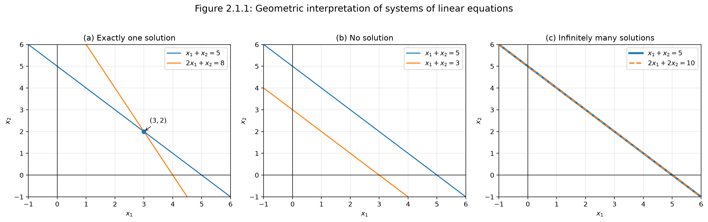

# 2.1 Systems of Linear Equations

## Why This Section Matters

Systems of linear equations are one of the starting points of linear algebra.

A system of linear equations describes multiple linear constraints that must be satisfied at the same time. This idea appears constantly in machine learning: solving for model parameters, fitting linear regression models, understanding feature redundancy, and working with high-dimensional data matrices.

In this section, we learn:

* what a system of linear equations is,
* what it means to solve one,
* why a system can have no solution, one solution, or infinitely many solutions,
* how to interpret systems geometrically,
* how systems lead naturally to matrix notation.

---

## 1. Linear Equations

A **linear equation** is an equation where the unknown variables appear only to the first power and are not multiplied with each other.

For example,

$$
2x_1 + 3x_2 = 8
$$

is linear.

But the following are not linear:

$$
x_1^2 + x_2 = 5
$$

$$
x_1x_2 = 7
$$

$$
\sin(x_1) + x_2 = 3
$$

A general linear equation with $n$ unknowns has the form

$$
a_1x_1 + a_2x_2 + \cdots + a_nx_n = b
$$

where:

| Symbol                  | Meaning                     |
| ----------------------- | --------------------------- |
| $x_1, x_2, \ldots, x_n$ | unknown variables           |
| $a_1, a_2, \ldots, a_n$ | known coefficients          |
| $b$                     | known right-hand-side value |

!!! intuition
    A linear equation says that a weighted combination of unknowns must equal a fixed value.

---

## 2. Systems of Linear Equations

A **system of linear equations** is a collection of linear equations that must all be true simultaneously.

A general system with $m$ equations and $n$ unknowns is

$$
a_{11}x_1 + a_{12}x_2 + \cdots + a_{1n}x_n = b_1
$$

$$
a_{21}x_1 + a_{22}x_2 + \cdots + a_{2n}x_n = b_2
$$

$$
\vdots
$$

$$
a_{m1}x_1 + a_{m2}x_2 + \cdots + a_{mn}x_n = b_m.
$$

A solution is a tuple

$$
(x_1, x_2, \ldots, x_n)
$$

that satisfies every equation in the system.

!!! example
    Consider

    $$
    x_1 + x_2 = 10
    $$

    $$
    2x_1 + x_2 = 14.
    $$

    Subtract the first equation from the second:

    $$
    (2x_1 + x_2) - (x_1 + x_2) = 14 - 10.
    $$

    Therefore,

    $$
    x_1 = 4.
    $$

    Substitute into the first equation:

    $$
    4 + x_2 = 10.
    $$

    So,

    $$
    x_2 = 6.
    $$

    Hence the solution is

    $$
    (x_1, x_2) = (4, 6).
    $$

---

## 3. The Core Intuition

A system of linear equations is a set of constraints.

Each equation says:

> The variables must combine in this particular way to produce this value.

Solving the system means finding values of the variables that satisfy all constraints at once.

For example, suppose a coffee shop produces two drinks:

* $x_1$ = number of lattes,
* $x_2$ = number of mochas.

Each latte uses 2 units of milk and 1 unit of espresso.
Each mocha uses 1 unit of milk and 2 units of espresso.

If the shop wants to use exactly 11 units of milk and 10 units of espresso, then

$$
2x_1 + x_2 = 11
$$

$$
x_1 + 2x_2 = 10.
$$

Solving:

From the first equation,

$$
x_2 = 11 - 2x_1.
$$

Substitute into the second equation:

$$
x_1 + 2(11 - 2x_1) = 10.
$$

So,

$$
x_1 + 22 - 4x_1 = 10.
$$

Therefore,

$$
-3x_1 = -12,
$$

so

$$
x_1 = 4.
$$

Then

$$
x_2 = 3.
$$

So the coffee shop should make:

$$
4 \text{ lattes and } 3 \text{ mochas}.
$$

---

## 4. Possible Solution Types

A real-valued system of linear equations can have only three possible solution behaviors:

1. no solution,
2. exactly one solution,
3. infinitely many solutions.

It cannot have exactly two or exactly three solutions.

---

## 5. Case 1: No Solution

Consider

$$
x_1 + x_2 = 5
$$

and

$$
2x_1 + 2x_2 = 12.
$$

If the first equation is true, then multiplying it by 2 gives

$$
2x_1 + 2x_2 = 10.
$$

But the second equation says

$$
2x_1 + 2x_2 = 12.
$$

This is impossible.

Therefore, the system has **no solution**.

!!! intuition
    A system has no solution when its constraints contradict each other.

---

## 6. Case 2: Exactly One Solution

Consider

$$
x_1 + x_2 = 10
$$

and

$$
2x_1 + x_2 = 14.
$$

Subtracting the first equation from the second gives

$$
x_1 = 4.
$$

Then

$$
x_2 = 6.
$$

So the system has exactly one solution:

$$
(x_1, x_2) = (4, 6).
$$

!!! intuition
    A system has one solution when the constraints are independent enough to pin down a single point.

---

## 7. Case 3: Infinitely Many Solutions

Consider

$$
x_1 + x_2 = 5
$$

and

$$
2x_1 + 2x_2 = 10.
$$

The second equation is just twice the first equation.

So both equations represent the same constraint.

The system is effectively just

$$
x_1 + x_2 = 5.
$$

Let

$$
x_1 = t,
$$

where $t \in \mathbb{R}$.

Then

$$
x_2 = 5 - t.
$$

So the solution set is

$$
(x_1, x_2) = (t, 5 - t), \quad t \in \mathbb{R}.
$$

Examples of valid solutions include

$$
(0,5), (1,4), (2,3), (10,-5).
$$

!!! intuition
    A system has infinitely many solutions when at least one variable remains free.

---

## 8. Why Exactly Two Solutions Are Impossible

Suppose a linear system has two different solutions $x$ and $y$.

That means

$$
Ax = b
$$

and

$$
Ay = b.
$$

Now take any linear interpolation between them:

$$
z = (1-t)x + ty,
$$

where $t \in \mathbb{R}$.

Then

$$
Az = A((1-t)x + ty).
$$

Using linearity,

$$
Az = (1-t)Ax + tAy.
$$

Since $Ax = b$ and $Ay = b$,

$$
Az = (1-t)b + tb.
$$

Therefore,

$$
Az = b.
$$

So every point on the line through $x$ and $y$ is also a solution.

Hence, if a linear system has two distinct solutions, it must have infinitely many solutions.

!!! takeaway
    A linear system can have no solution, one solution, or infinitely many solutions — but not exactly two.

---

## 9. Geometric Interpretation

### Two Variables: Lines

In two variables, each linear equation represents a line.

For example,

$$
x_1 + x_2 = 5
$$

is a line in the $x_1x_2$-plane.

A system of two linear equations asks where the two lines intersect.

There are three possibilities.

### One Intersection Point

If two lines meet at one point, the system has one solution.

Example:

$$
x_1 + x_2 = 5
$$

$$
2x_1 + x_2 = 8.
$$

The lines intersect at

$$
(3,2).
$$

### No Intersection

If two lines are parallel and distinct, the system has no solution.

Example:

$$
x_1 + x_2 = 5
$$

$$
x_1 + x_2 = 3.
$$

These lines never meet as shown in Figure 2.1 (b).

### Same Line

If both equations describe the same line, the system has infinitely many solutions.

Example:

$$
x_1 + x_2 = 5
$$

$$
2x_1 + 2x_2 = 10.
$$

Both equations describe the same line; see Figure 2.1 (c).

Every point on that line is a solution.

*Three possible geometric outcomes for two linear equations in two variables: one intersection point, no intersection, or the same line.*

---

## 10. Three Variables: Planes

In three variables, each linear equation represents a plane.

A system of equations asks where the planes intersect.

The solution set can be:

| Geometric situation                                        | Solution type             |
| ---------------------------------------------------------- | ------------------------- |
| planes do not share a common intersection                  | no solution               |
| planes meet at one point                                   | exactly one solution      |
| planes intersect along a line                              | infinitely many solutions |
| equations describe the same plane or redundant constraints | infinitely many solutions |

!!! note
    A plane is a flat two-dimensional surface living in three-dimensional space. It has length and width, but no thickness.

---

## 11. Redundant Equations

An equation is **redundant** if it does not add new information to the system.

Example:

$$
x_1 + x_2 + x_3 = 3
$$

$$
x_1 - x_2 + 2x_3 = 2
$$

Add the two equations:

$$
2x_1 + 3x_3 = 5.
$$

So if the system also contains

$$
2x_1 + 3x_3 = 5,
$$

then the third equation is redundant because it is already implied by the first two.

!!! intuition
    Redundant equations do not change the solution set. They repeat information that is already present.

---

## 12. Matrix Form

The system

$$
a_{11}x_1 + a_{12}x_2 + \cdots + a_{1n}x_n = b_1
$$

$$
a_{21}x_1 + a_{22}x_2 + \cdots + a_{2n}x_n = b_2
$$

$$
\vdots
$$

$$
a_{m1}x_1 + a_{m2}x_2 + \cdots + a_{mn}x_n = b_m
$$

can be written compactly as

$$
Ax = b.
$$

Here,

$$
A =
\begin{bmatrix}
a_{11} & a_{12} & \cdots & a_{1n} \\
a_{21} & a_{22} & \cdots & a_{2n} \\
\vdots & \vdots & \ddots & \vdots \\
a_{m1} & a_{m2} & \cdots & a_{mn}
\end{bmatrix},
$$

$$
x =
\begin{bmatrix}
x_1 \\
x_2 \\
\vdots \\
x_n
\end{bmatrix},
$$

and

$$
b =
\begin{bmatrix}
b_1 \\
b_2 \\
\vdots \\
b_m
\end{bmatrix}.
$$

So:

| Object | Meaning                |
| ------ | ---------------------- |
| $A$    | coefficient matrix     |
| $x$    | vector of unknowns     |
| $b$    | right-hand-side vector |

---

## 13. Row View

In the row view, each row of $A$ represents one equation.

For example, if

$$
A =
\begin{bmatrix}
2 & 3 \\
1 & -1
\end{bmatrix},
\quad
x =
\begin{bmatrix}
x_1 \\
x_2
\end{bmatrix},
\quad
b =
\begin{bmatrix}
8 \\
1
\end{bmatrix},
$$

then

$$
Ax = b
$$

means

$$
2x_1 + 3x_2 = 8
$$

and

$$
x_1 - x_2 = 1.
$$

!!! intuition
    The row view sees a linear system as a collection of constraints.

---

## 14. Column View

In the column view, the system

$$
Ax = b
$$

is interpreted as a weighted combination of the columns of $A$.

Suppose

$$
A =
\begin{bmatrix}
1 & 2 \\
3 & 1
\end{bmatrix}.
$$

Then

$$
Ax =
x_1
\begin{bmatrix}
1 \\
3
\end{bmatrix}
+
x_2
\begin{bmatrix}
2 \\
1
\end{bmatrix}.
$$

So solving

$$
Ax = b
$$

means finding weights $x_1$ and $x_2$ such that

$$
x_1a_1 + x_2a_2 = b,
$$

where $a_1$ and $a_2$ are the columns of $A$.

!!! intuition
    The column view asks: can we build the target vector $b$ by combining the columns of $A$?

---

## 15. Worked Example: Row and Column View

Consider

$$
A =
\begin{bmatrix}
1 & 2 \\
3 & 1
\end{bmatrix},
\quad
x =
\begin{bmatrix}
x_1 \\
x_2
\end{bmatrix},
\quad
b =
\begin{bmatrix}
8 \\
9
\end{bmatrix}.
$$

The system

$$
Ax = b
$$

means

$$
x_1 + 2x_2 = 8
$$

$$
3x_1 + x_2 = 9.
$$

From the first equation,

$$
x_1 = 8 - 2x_2.
$$

Substitute into the second:

$$
3(8 - 2x_2) + x_2 = 9.
$$

So,

$$
24 - 6x_2 + x_2 = 9.
$$

Therefore,

$$
-5x_2 = -15,
$$

so

$$
x_2 = 3.
$$

Then

$$
x_1 = 8 - 2(3) = 2.
$$

Hence,

$$
x =
\begin{bmatrix}
2 \\
3
\end{bmatrix}.
$$

Column view:

$$
2
\begin{bmatrix}
1 \\
3
\end{bmatrix}
+
3
\begin{bmatrix}
2 \\
1
\end{bmatrix}
=
\begin{bmatrix}
2 \\
6
\end{bmatrix}
+
\begin{bmatrix}
6 \\
3
\end{bmatrix}
=
\begin{bmatrix}
8 \\
9
\end{bmatrix}.
$$

So the solution tells us how to combine the columns of $A$ to produce $b$.

---

## 16. Connection to Machine Learning

### Linear Regression

In linear regression, we often write the prediction problem as

$$
X\theta \approx y.
$$

This looks like a system of linear equations.

Here:

| Symbol   | Meaning          |
| -------- | ---------------- |
| $X$      | data matrix      |
| $\theta$ | parameter vector |
| $y$      | target vector    |

If the equation

$$
X\theta = y
$$

has an exact solution, we can fit the targets perfectly.

But real-world data is usually noisy, so an exact solution often does not exist.

Instead, linear regression solves an approximate problem:

$$
X\theta \approx y.
$$

The goal is to find the parameter vector $\theta$ that makes predictions as close as possible to the observed targets.

---

## 17. Feature Redundancy

In machine learning, the columns of $X$ often represent features.

If one feature can be expressed as a combination of other features, then the data matrix contains redundant information.

For example, suppose a dataset contains:

* price before tax,
* tax,
* total price.

If

$$
\text{total price} = \text{price before tax} + \text{tax},
$$

then one column is determined by the others.

This can lead to non-unique parameter solutions.

In linear algebra, this is related to linear dependence.

In machine learning, this is related to multicollinearity.

---

## 18. Noisy Data and Inconsistent Systems

A system may have no exact solution when its equations contradict each other.

In machine learning, this is common because real-world data is noisy.

For example, two identical inputs may have different observed outputs due to measurement error.

Instead of requiring a perfect solution, machine learning usually searches for the best approximate solution.

This leads naturally to least squares.

---

## 19. Common Confusions

### Confusion 1: Infinite solutions means every vector is a solution

No.

Infinite solutions usually means there is a structured set of solutions, such as a line or plane.

For example,

$$
x_1 + x_2 = 5
$$

has infinitely many solutions, but not every pair $(x_1,x_2)$ is valid.

The pair $(100,100)$ is not a solution because

$$
100 + 100 \neq 5.
$$

---

### Confusion 2: No solution means the problem is useless

No.

In machine learning, no exact solution is normal.

It usually means we need an approximate solution.

This is the motivation behind least-squares regression.

---

## 20. Summary

A system of linear equations is a collection of linear constraints.

The general form is

$$
a_{i1}x_1 + a_{i2}x_2 + \cdots + a_{in}x_n = b_i.
$$

The compact matrix form is

$$
Ax = b.
$$

A system can have:

* no solution,
* exactly one solution,
* infinitely many solutions.

Geometrically:

* in two variables, equations are lines,
* in three variables, equations are planes,
* in higher dimensions, equations are hyperplanes.

The row view treats each equation as a constraint.

The column view treats $Ax = b$ as asking whether $b$ can be built from a weighted combination of the columns of $A$.

Systems of linear equations are foundational for machine learning because they appear in linear regression, least squares, data matrices, feature redundancy, and parameter estimation.

---

## 21. Quick Check

1. What makes an equation linear?
2. Why can a linear system not have exactly two solutions?
3. What does each equation represent geometrically in two variables?
4. What does each equation represent geometrically in three variables?
5. What is the difference between the row view and the column view of $Ax=b$?
6. Why does noisy data often lead to systems with no exact solution?
7. How is linear regression connected to systems of linear equations?

---

## 22. Key Formula Sheet

General linear equation:

$$
a_1x_1 + a_2x_2 + \cdots + a_nx_n = b
$$

General system:

$$
a_{i1}x_1 + a_{i2}x_2 + \cdots + a_{in}x_n = b_i
$$

Matrix form:

$$
Ax = b
$$

Column view:

$$
Ax = x_1a_1 + x_2a_2 + \cdots + x_na_n
$$

Linear regression form:

$$
X\theta \approx y
$$
